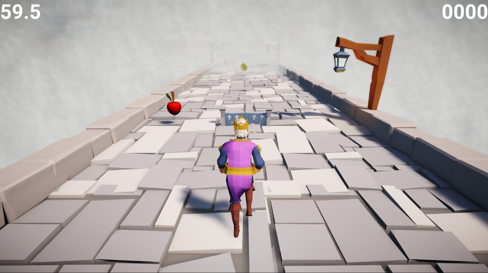
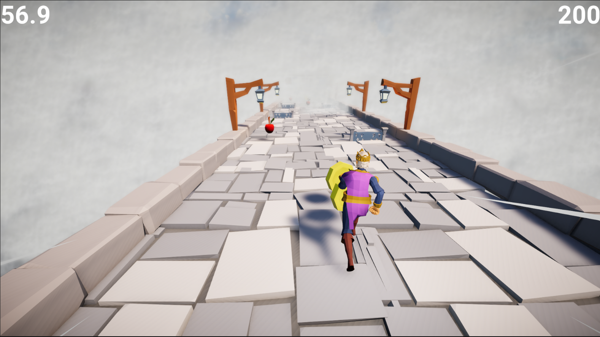
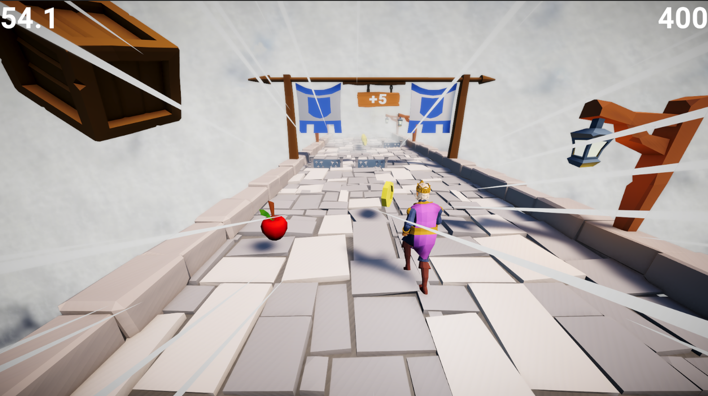
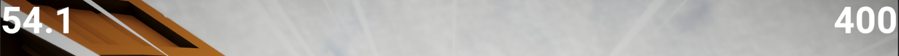
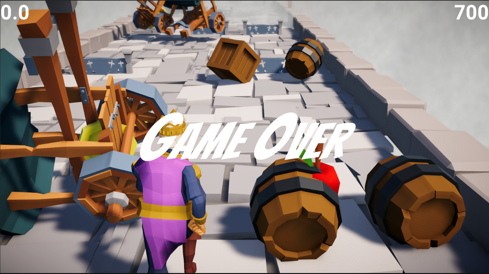

# RoyalRun

A third-person endless runner developed in Unity 6 using C#.

## Overview

RoyalRun is an endless runner project focused on character movement, procedural level generation, pickups, checkpoints, scoring systems, and gameplay progression.

## Features

- Third Person Character Controller
- Endless Runner Gameplay
- Procedural Chunk Generation
- Pickups and Collectibles
- Checkpoint System
- Score System
- Character Animations
- Camera Systems
- Game Over Logic

## Technologies Used

- Unity 6
- C#
- TextMeshPro
- Animator Controller
- Physics System

## Screenshots

## Author

Bhavesh Kumar
